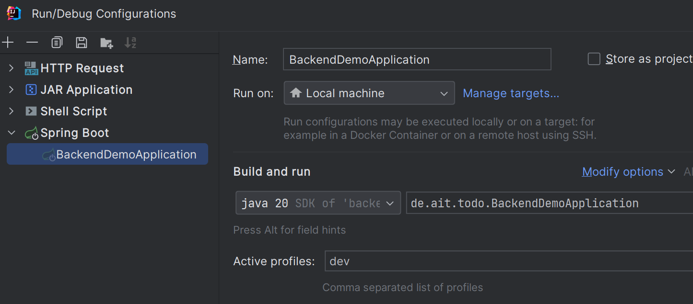
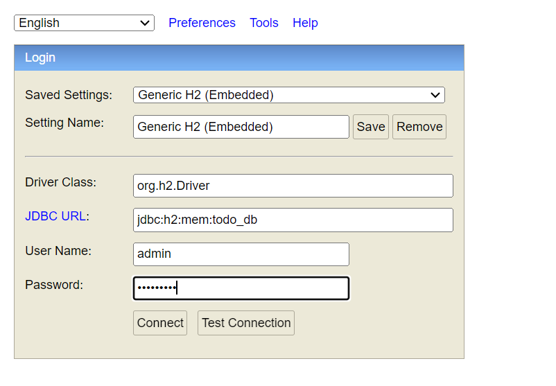

# Демонстрационное Spring Boot приложение

## Запуск приложения

* Приложение может быть запущено с использованием одного из профилей:
  * `dev` - включено логирование запросов к СУБД и логирование Spring Security
  * `prod` - логирование полностью отключено

* Для запуска из среды Intellij IDEA необходимо указать необходимый профиль в `Active Profile`

## Endpoint

* `/swagger-ui.html` - документация по API
* `/h2-console` - консоль для управления InMemory-базой данных (`admin/qwerty007`)

## Аутентификация

* Используется Cookie Based аутентификация
* Необходимо отправить POST-запрос с логином и паролем пользователя. Далее будет создана сессия, которая указывается в Cookie `JSESSIONID`
* Пример запроса в [Requests](src/main/resources/http/requests.http)
* `/login` - URL-для ввода логина и пароля через стандартную страницу
* По умолчанию после успешного прохождения аутентификации пользователь будет перенаправлен в `swagger`. Для другого поведения необходимо изменить `defaultSuccessUrl("/swagger-ui/index.html")` в `SecurityConfig`
* В `Swagger` и `HTTP Client Intellij IDEA` для аутентификации необходимо отправить запрос с логином и паролем. Далее, все запросы в рамках текущей сессии (до перезапуска приложения) будут аутентифицированы автоматически.  

## Дополнительно

* После старта приложения в СУБД уже добавлен пользователь с логином `admin@ait-tr.de` и паролем `admin`
* По умолчанию приложение открывает страницу `swagger`. Для другого поведения необходимо изменить параметр `app.root-redirect-url` в `.properties`-файле